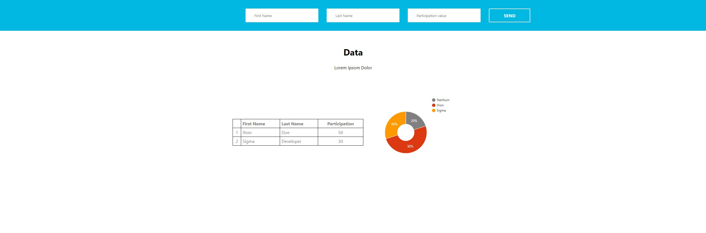

<p align="center">

</p>

## Sumário
<details>
  <summary>Índices</summary>
  
  - [Desafio técnico Cubo Network](#desafio-técnico-cubo-network)
  - [Rodar por Docker](#rodar-por-docker)
  - [Rodar Manualmente](#rodar-manualmente)
  - [O projeto:](#o-projeto)
    - [Especificação da interface gráfica](#especificação-da-interface-gráfica)
    - [Especificação de Rotas da API](#especificação-de-rotas-da-api)
    - [Tecnologias](#tecnologias)
    - [Contato](#contato)
</details>

<br />

# Desafio técnico Cubo Network

- Esse repositório representa minha solução ao desafio técnico, para desenvolvedores full-stack, da Cubo Network, iniciativa da Itaú, postado, em 2016, no repositório: https://github.com/cubonetwork/fullstack-challenge.

# Rodar por Docker

- O Docker foi utilizado nesse projeto para encapsular os diferentes serviços — dashboard, api, database —, da aplicação, tal como as dependências necessárias para bom funcionamento.

Instalação de arquivos:
```
git clone https://github.com/ribmarciojr/itau-full-stack-challenger.git
```
Execução do projeto:
```
docker-compose up
```
---
**Observação**

O comando acima deve ser executado na raiz do projeto.

---

> Agora o projeto pode ser acessado no browser através do endereço: ```http://localhost:3000```


# Rodar Manualmente

## Requisitos
Lista de requisitos necessários para executar o projeto. Isso pode incluir software, hardware, bibliotecas específicas, etc.

- Node.js: 18.17.0+
- Python: 3.11.0+

## Configuração do Ambiente
Passos para configurar o ambiente de desenvolvimento. Isso pode incluir a instalação de dependências, configuração de variáveis de ambiente, etc.

### 1. Dependências Python
```bash
# Em ./api/v1 
pip install -r requirements.txt

# Execução
flask --app run.py run --host=0.0.0.0
```

### 2. Dependências Node.js
```bash
# Em ./dashboard 
npm install

#Execução
npm run dev
```

---
**Observação**

O banco de dados PostgresSQL deve ser criado separadamente com as descrições do arquivo ``` docker-compose.yaml```

---

# O projeto: 

# Especificação da interface gráfica 


## Visão Geral
Como especificado no desafio, o front-end segue a implementação dinâmica da tabela, gráfico de pizza e formulário para adição de novos membros.

<br />

# Especificação de Rotas da API


## Base URL
A URL base para todas as requisições à API é: `https://localhost:5000`

## Recursos

### 1. Cria participantes

#### [POST] /create/participant
**Descrição**: Insere um novo participante no banco de dados, caso válido.

**Parâmetros esperados:**
- `first_name`: Deve conter apenas somente letras. Mínimo três.
- `last_name`: Deve conter apenas somente letras. Mínimo três
- `participation`: Deve conter números decimais.

**Exemplo de Requisição:**
```json
POST /create/participant
{
    "first_name": "Jhon",
    "last_name": "Dow",
    "participation": "30.00" 
}
```
### 2. Lista participantes

#### [GET] /participants/all
**Descrição**: Obtém uma lista de todos os participantes.


**Exemplo de Requisição:**
```json
GET /participants/all
```

### 3. Deleta participantes

#### [DELETE] /create/participant
**Descrição**: Deleta um participante do banco de dados.

**Parâmetros esperados:**
- `first_name`: Deve conter apenas somente letras. Mínimo três.


**Exemplo de Requisição:**
```json
DELETE /create/participant
{
    "first_name": "Jhon"
}
```

# Tecnologias 

Esse projeto foi construído com:

- NextJS
- Flask
- PostgresSQL
- Docker/Docker-compose
- Typescript 
- Python
- HTML
- CSS

# Contato

Email: marciojunior2109@gmail.com
Linkedin: https://www.linkedin.com/in/ribmarciojunior/

<br />

<p align="center">
    Copyright (c) 2024 Ribmarciojr
</p>